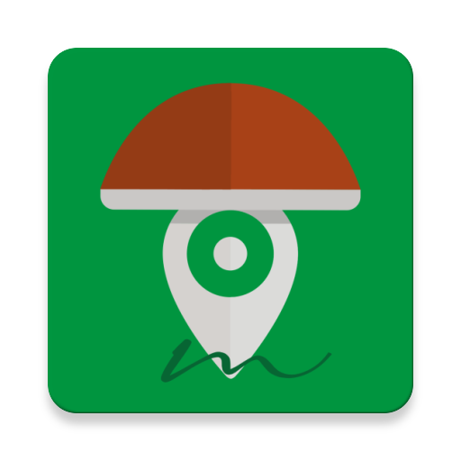

# MicoApp
An Android application to support everyone who likes to search mushrooms.

This app was born in 2019 as a project for the course of 
[Laboratorio di Applicazioni Mobili](https://www.unibo.it/it/didattica/insegnamenti/insegnamento/2018/367016) 
at University of Bologna, but the focus was to do something more than a simple and almost useless project for an exam.

If you like to search mushrooms like me this app could help you to keep a personal record of 
which mushrooms, where have you found them and eventually share these finds with your friends 
(I know how jealous is a searcher, so there is no possibility to share online your informations).

## How to install
Obviously you can fork or copy the entire project to build it yourself, but if you are interested
only to the final application, [here](MicoApp_1.0.0(33).apk) you can find apk. 
I have no official site and no distribution channel other than GitHub, so don't trust anyone else.

## License
Please take a look at **open source license**.  
More than an exam these application has been and will be a pleasure (I will continue to work in spare time);
when it will be completed, I will publish it on PlayStore for free,
without ads and eventually with a donation options.  
Feel free to copy, modify and redistribute these code, but I would like that it remains free, open and without ads.

## Contacts
You can contact me on *Telegram* or with an *e-mail*. 
An option inside app allows to enter in contact with me in a fast way (just a couple of tap).

## Notes
At the moment app is absolutely not complete, it lacks of some features and optimization (obviously it 
is not harmful for you smartphone or for data saved on it).

## Special thanks
- Co-Ideator
  - Roberto Cocchi
- Technical support
  - Nicola Fava
- Designer
  - Agnese Testoni
- Main Tester
  - Agnese Testoni
  - Francesco Bellei
  - Nicola Fava
  - Roberto Cocchi
  - Rubens Ferrari
- All the members of my Telegram channel
